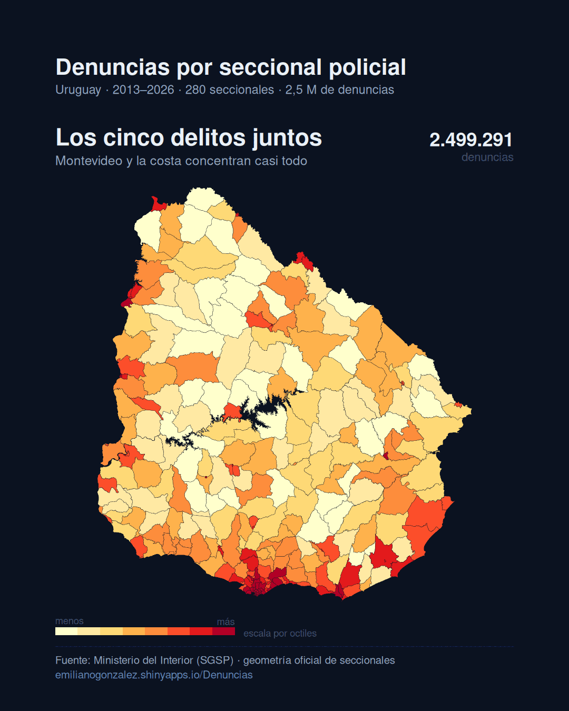
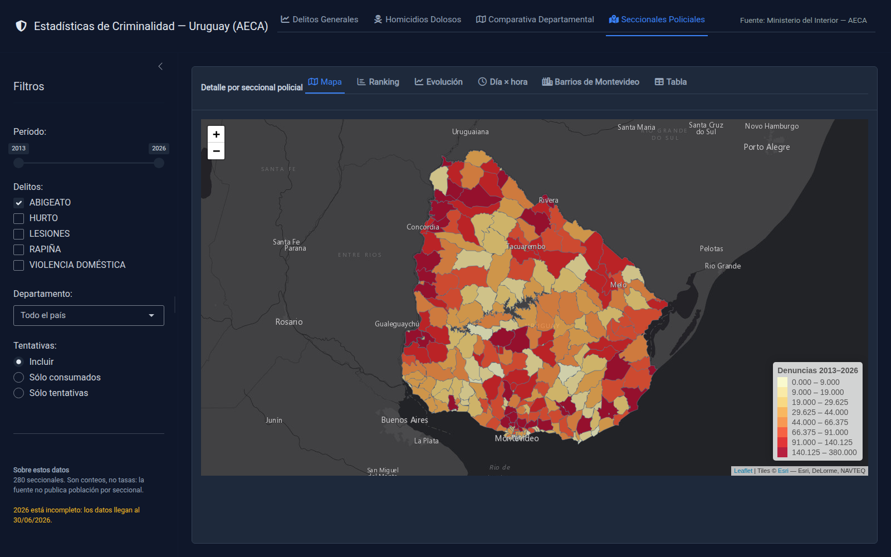
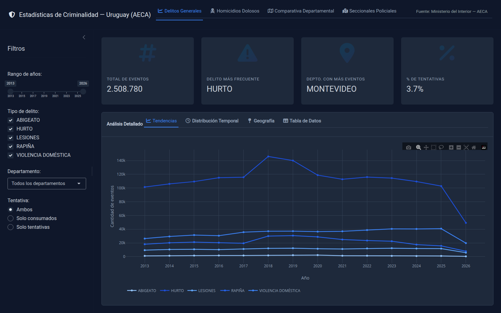
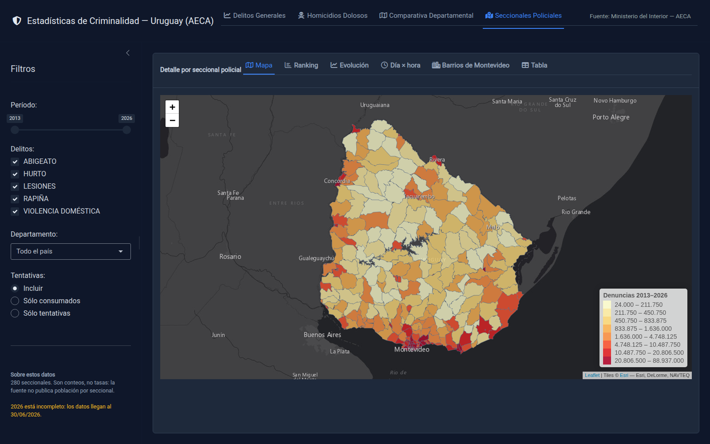

# criminalidad-uruguay

App Shiny para explorar las **estadísticas de criminalidad de Uruguay** con datos
oficiales del **Ministerio del Interior (AECA)** — Sistema de Gestión de
Seguridad Pública (SGSP). 2,5 millones de denuncias, de enero de 2013 al último
trimestre cerrado.

🔗 **App en vivo:** https://emilianogonzalez.shinyapps.io/Denuncias/

## El detalle que la fuente publica y casi nadie usa

Los datos de criminalidad se suelen mirar por departamento, y el departamento es
una unidad demasiado grande: Montevideo entero pintado de un color no dice nada
sobre dónde pasan las cosas. La fuente en realidad trae la **seccional policial**,
sólo que como texto. Esta app le pone la geometría oficial encima: **280
seccionales en vez de 19 departamentos.**



El ejemplo más claro es el **abigeato**, porque rompe el reflejo de leer todo mapa
de delito como un mapa de densidad de población:

| Delito | Denuncias | Son de Montevideo |
|---|---:|---:|
| Hurto | 1.549.798 | 47,9% |
| Rapiña | 299.288 | **81,0%** |
| Violencia doméstica | 479.913 | 34,3% |
| Lesiones | 151.367 | 37,8% |
| Abigeato | 19.148 | **1,6%** |

La seccional con más hurtos tiene 58.698 denuncias y está en Montevideo; la que
encabeza abigeato tiene 380 y está en Sauce. Cuando cambiás el delito, el mapa se
da vuelta.



## Secciones

1. **Delitos generales** — evolución anual por tipo de delito (hurto, rapiña,
   violencia doméstica, lesiones, abigeato), ranking departamental, heatmap
   día×hora, tabla agregada. Filtros por año, tipo, departamento y tentativa.
2. **Homicidios dolosos** — evolución y tasa de esclarecimiento, distribución por
   motivo, arma, edad y relación víctima-agresor.
3. **Comparativa departamental** — mapa coroplético y ranking por indicador.
4. **Seccionales policiales** — el nivel geográfico más fino de la fuente. Ver
   abajo.



## La pestaña de seccionales



Seis vistas sobre las mismas 280 unidades, con filtros de período (2013 al
último trimestre), tipo de delito, departamento y tentativa:

| Vista | Qué muestra |
|---|---|
| **Mapa** | Coroplético con escala por octiles. Lineal no sirve: tres seccionales de Montevideo aplastan al resto del país. |
| **Ranking** | Las 30 seccionales con más denuncias, con nombre y departamento. |
| **Evolución** | Serie mensual por tipo de delito. |
| **Día × hora** | Heatmap, restringido a los delitos que registran hora (ver abajo). |
| **Barrios de Montevideo** | Los 30 barrios con más denuncias. |
| **Tabla** | Una fila por seccional, columnas por delito, descargable en CSV. |

### Cómo se identifica una seccional

`sec_id` = departamento + número, por ejemplo `ARTIGAS|1`. **No alcanza con la
columna `JURISDICCION` de la fuente:** tiene sólo 33 valores distintos para 280
seccionales, porque `SECCIONAL 10` existe en casi todos los departamentos.

La otra trampa es que **el shapefile oficial escribe `TACUEREMBO`**. Sin
corregirlo, Tacuarembó entero queda sin cruzar —unos 45.000 eventos— y el mapa lo
dibuja vacío sin dar ningún error.

Corregidas las dos, cruza el **99,62%** de los eventos y las 280 seccionales
tienen datos. El 0,38% restante es jurisdicción no territorial (Prefectura,
Policía Marítima, Sin Clasificar): no tiene polígono ni debería tenerlo.

## Una advertencia sobre la hora

La hora falta en el 55% de las denuncias, pero **no al azar**:

| Delito | Sin hora |
|---|---:|
| Rapiña · Lesiones · Violencia doméstica | 0% |
| Hurto | 87,9% |
| Abigeato | 100% |

Es estructural: al hurto se lo descubre después y la víctima no sabe cuándo
ocurrió. Los heatmaps de la app lo dicen explícitamente, y el de seccionales
directamente excluye hurto y abigeato.

## Otras advertencias

- **Son conteos, no tasas.** La fuente no publica población por seccional.
- **El último año está incompleto**: los datos llegan al último trimestre
  cerrado. La app lo avisa en la barra lateral.
- **El barrio sólo existe para Montevideo.**

## Los datos: por qué la app no lee el CSV crudo

El CSV de denuncias pesa **376 MB**. `scripts/02_preparar_datos_app.R` lo
convierte una sola vez a parquet **evento a evento, sin perder ninguna columna**:
2,5 M de filas entran en 13 MB. Se conserva el detalle completo —fecha exacta,
hora, seccional, barrio— y el bundle del deploy baja a ~20 MB.

| | Crudo | En `data/app/` |
|---|---|---|
| Denuncias | 376 MB · 2,5 M eventos | 12,8 MB (parquet) |
| Homicidios | 430 KB (xlsx) | 0,09 MB |
| Seccionales | 9,2 MB (shapefile) | 1,10 MB (simplificado a 25 m) |
| Departamentos | — | 1,37 MB (disueltos de las seccionales) |


El mapa base es **Esri Dark Gray Canvas**, no CARTO: CARTO pasó a exigir API key
en todos sus hosts y devolvía las tiles con un `API KEY REQUIRED` estampado
encima.

### De dónde salen los datos crudos

Del [catálogo de datos abiertos](https://catalogodatos.gub.uy/dataset/ministerio-del-interior-delitos_denunciados_en_el_uruguay),
que se actualiza **trimestralmente**:

- *Denuncias de otros delitos (CSV)* → `data/otros-delitos.csv` (no versionado,
  separado por `;` con BOM UTF-8)
- *Homicidios dolosos consumados (XLSX)* → `data/homicidios_dolosos_consumados.xlsx`

Cobertura actual: denuncias hasta el **30/06/2026**, homicidios hasta **2026**.

## Correr y desplegar

```r
shiny::runApp()     # desde la raíz del proyecto
```

```bash
Rscript scripts/02_preparar_datos_app.R   # sólo si cambiaron los datos crudos
Rscript scripts/03_gif_seccionales.R      # regenera el GIF de arriba
Rscript scripts/deploy.R                  # publica en shinyapps.io
```

## Estructura

```
app.R                  UI + server (navbar de 4 secciones)
global.R               carga los parquet y la geometría al iniciar
R/                     módulos: delitos, homicidios, comparativa, seccionales
scripts/               02 crudo → parquet · 03 GIF de portada · deploy
data/app/              lo que carga y despliega la app
data/seccionales_shp/  shapefile oficial (EPSG:32721)
docs/                  spec original, manifest del deploy viejo, imágenes
qgis/                  proyecto QGIS con el shape y el KML
```

---

Fuente: Ministerio del Interior — Sistema de Gestión de Seguridad Pública (SGSP).
Geometría: shapefile oficial de seccionales policiales.
