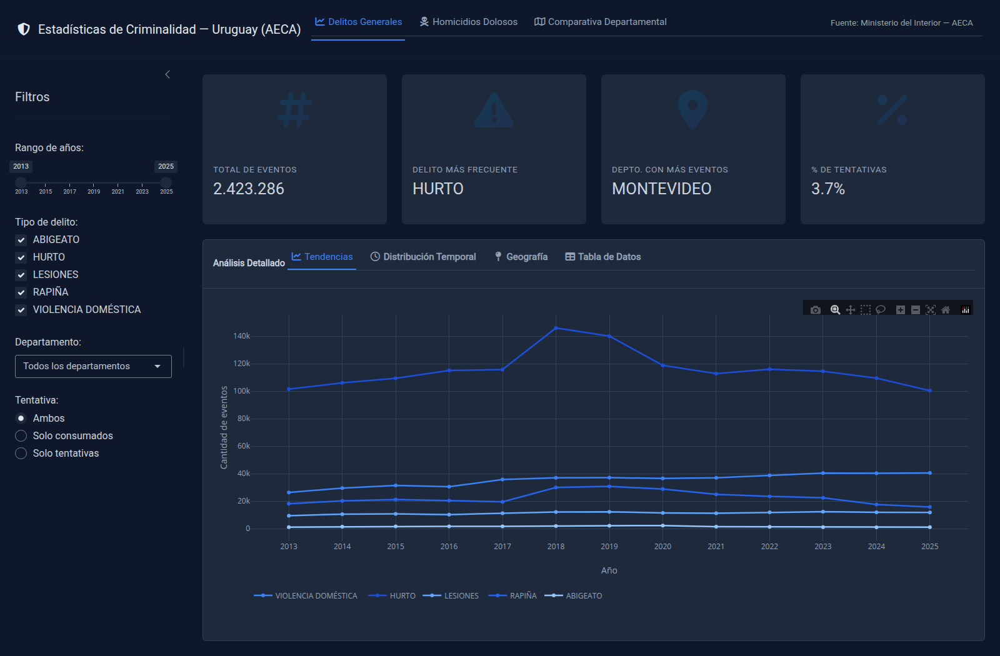

# criminalidad-uruguay

App Shiny para analizar **estadísticas de criminalidad en Uruguay** con datos
oficiales del **Ministerio del Interior (AECA)** — Sistema de Gestión de
Seguridad Pública (SGSP), cobertura nacional desde 2013.

🔗 **App en vivo:** https://emilianogonzalez.shinyapps.io/Denuncias/



## Secciones

1. **Delitos generales** — evolución anual por tipo de delito (hurto, rapiña,
   violencia doméstica, lesiones, abigeato), ranking departamental, heatmap
   día×hora, tabla agregada. Filtros por año, tipo, departamento y tentativa.
2. **Homicidios dolosos** — evolución + tasa de esclarecimiento, distribución por
   motivo / arma / edad / relación víctima-agresor. Filtros por año, depto,
   motivo, sexo y arma.
3. **Comparativa departamental** — mapa coroplético (`leaflet` +
   `rnaturalearth`) y ranking por indicador.

UI con `bslib` (`page_navbar`, tema *flatly*), gráficos `plotly`, tablas `DT`.

## Datos (`data/`)

- `homicidios_dolosos_consumados.xlsx` — 4.356 homicidios dolosos (2013–2025). **Versionado.**
- `delitos_2013_2025tri4.csv` — ~2,4 M eventos delictivos (2013–2025), separado
  por `;`, UTF-8 BOM. **NO versionado** (~347 MB, supera el límite de GitHub):
  está en `.gitignore`. Descargar de datos abiertos del Ministerio del Interior
  y dejarlo en `data/` (el nombre debe matchear `delitos_2013_2025tri4*.csv`).

Detalle metodológico y diccionario de variables en
[`docs/prompt_shiny_criminalidad_uruguay.md`](docs/prompt_shiny_criminalidad_uruguay.md).

## Correr

```r
shiny::runApp()   # desde la raíz del proyecto; global.R carga los datos al iniciar
```

Dependencias: capturadas en `manifest.json` (bundle original de shinyapps.io,
R 4.2.2). `global.R` también autoinstala los paquetes faltantes al arrancar.

## Estructura

```
app.R          UI + server (navbar de 3 secciones)
global.R       carga y normaliza datos al iniciar
R/             módulos (mod_delitos, mod_homicidios, mod_comparativa)
data/          datos (el CSV grande va en .gitignore)
docs/          especificación metodológica
manifest.json  dependencias del deploy original
```

---

Origen: bundle descargado de shinyapps.io (migración de cuenta).
Memoria/metadata: sistema `Mec/Claude/`.
